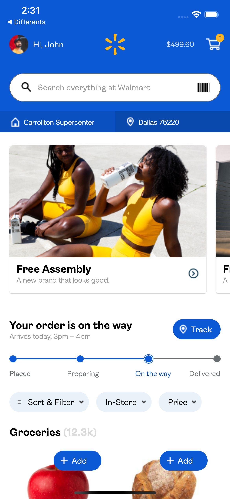
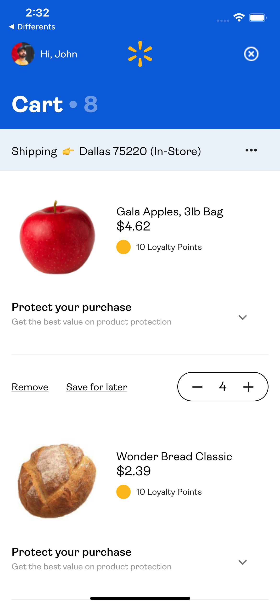
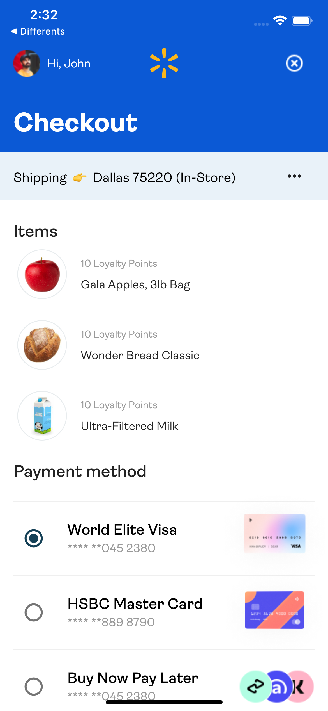
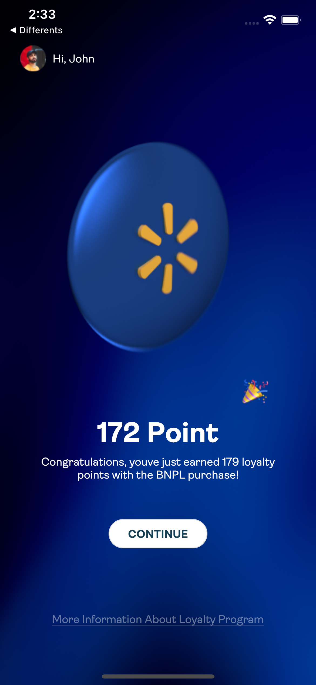

# walmart_app_design

The project is made on the design in figma: https://www.figma.com/file/tt8r0RQ81DpLkJ8fX4dav7/%F0%9F%9B%8D-Walmart-App-Design-(Community)?node-id=0%3A1

Samples:

  

  

  

  

## Getting Started

This project is a starting point for a Flutter application.

A few resources to get you started if this is your first Flutter project:

- [Lab: Write your first Flutter app](https://flutter.dev/docs/get-started/codelab)
- [Cookbook: Useful Flutter samples](https://flutter.dev/docs/cookbook)

For help getting started with Flutter, view our
[online documentation](https://flutter.dev/docs), which offers tutorials,
samples, guidance on mobile development, and a full API reference.
